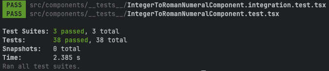

# Roman Numeral UI

A Next.js application for converting integers to Roman numerals using React Spectrum components.


## Features

- Convert integers to Roman numerals
- Modern, accessible UI using Adobe's React Spectrum design system
- Responsive design that works on all devices
- Built with Next.js 15 and TypeScript

## Dependencies 

### Next.js
Next.js is a react framework that provides building blocks for creating fast, scalable web applications.
- Server Side Rendering - allows fast page loads to improve SEO and UX
- Client Side Rendering - allows for fast re-rendering of dynamic content, providing better UX

### Roman Numeral Service
The backend web service that provides the functionality related to Roman numeral conversion, etc.

This project uses a openapi generated client based on the roman-numeral-openapi-spec.json provided by the service.

https://github.com/jasonmcaffee/roman-numeral-service

### React Spectrum
[React Spectrum](https://react-spectrum.adobe.com/)
#### 1. React Stately (@react-stately/*) - State Management Layer
Platform-agnostic state management
Responsibilities:
- Complex logic for collections, selection, and component state
- No UI rendering, just state management
- Cross-platform (web, React Native, UXP)
- No theme or design system specific logic

Examples: `useNumberFieldState`, `useToggleState`, `useSelectState`

#### 2. React Aria (@react-aria/*) - Behavior & Accessibility Layer
Platform-specific behavior and accessibility
Responsibilities:
- Event handling, focus management, accessibility, internationalization
- Platform-specific (DOM, React Native, etc.)
- No theme or design system specific logic
- Returns props to be spread onto rendered elements

Examples: `useNumberField`, `useButton`, `useTextField`

#### 3. React Spectrum (@adobe/react-spectrum) - UI Layer
Theme and design system specific
Responsibilities:
- Actual DOM structure and styling
- Uses props from behavior hook and state from state hook
- Implements Adobe's Spectrum design system
- Can be customized with themes

## Setup

### Docker
#### Building the Docker Image

From the `roman-numeral-ui` directory, run:

```bash
docker build -t roman-numeral-ui:latest .
```

#### Running the Container

##### Basic Run
```bash
docker run -p 3000:3000 --env-file .env roman-numeral-ui:latest
```

##### Docker Compose
The make file has convenience commands for running docker compose with datadog agent.

```shell
DD_API_KEY=123 make build-and-run
```

### Dev Setup for Local Development

First, install the dependencies:

```bash
yarn install
```

Then, run the development server:

```bash
npm run dev
```

Open [http://localhost:3001](http://localhost:3001) with your browser to see the result.

## Configuration

### Environment Variables

The application uses environment variables store in .env file for configuration.  You can override with .env.development, etc.

- npm run dev → development
- npm run build → production
- npm run start → production

#### Available Environment Variables
Note: The prefix NEXT_PUBLIC_ is needed for env variables needed by the browser.

- `NEXT_PUBLIC_ROMAN_NUMERAL_SERVICE_BASE_URL`: The base URL for the backend API service (default: `http://localhost:3000`)

### Backend Service

This UI connects to a backend Roman Numeral service. Make sure the backend service is running and accessible at the URL specified in `NEXT_PUBLIC_ROMAN_NUMERAL_SERVICE_BASE_URL`.


## Project Structure

### App
Directory for our pages.

### Components
Where we house our components used by various pages.

### Hooks
Our components use hooks, which help us separate our business logic, api calls, etc 

### Clients
Where we store clients, including the openapi generated client for our Roman Numeral Service.

# Testing Implementation for Roman Numeral UI
Our testing strategy follows patterns found in the react-spectrum library.

## Testing Stack

- Jest - Test runner and assertion library
- @testing-library/react - React component testing utilities
- @testing-library/user-event - User interaction simulation
- @testing-library/jest-dom - Custom Jest matchers for DOM assertions
- jsdom - DOM environment for testing
- ts-jest - TypeScript support for Jest

## Test Folder Structure
Tests are stored in __tests__ subfolders

- `__test__/test-utils.tsx` -  test utils for setup, etc.
- `components/__tests__` - tests related to rendering, as well as integration with our hooks
- `hooks/__tests__` - tests related to our hooks
- `__mocks__` - mocks for static assets and svg imports

## Test Categories
- Component Rendering: Initial render and element presence
- User Interactions: Input handling, form validation, etc
- Loading States: UI feedback during API calls
- Success States: Result display after successful conversions
- Error Handling: Validation errors and error message display
- Integration with Hook: Hook integration and state reflection

## Configuration
### Jest Configuration (`jest.config.js`)
Setup for our test environment, including module resolution, test matching patterns, etc.

### Test Setup (`src/setupTests.ts`)

- Jest DOM extensions
- IntersectionObserver and ResizeObserver mocks
- Console error/warning suppression for expected messages
- Global test cleanup

## Running Tests
```bash
npm test
```



